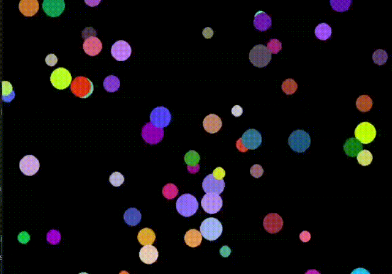

# Sistema de Partículas em Python

  
 

Este é um programa simples em Python que simula um sistema de partículas usando a biblioteca pygame. As partículas são exibidas na tela e se movem aleatoriamente, criando um efeito visual interessante.

## Funcionamento do Programa

O programa utiliza a biblioteca pygame para criar uma janela e exibir as partículas em movimento. Cada partícula é representada por um objeto da classe `Particle`, que possui uma posição, cor, raio e velocidade aleatórios.

O loop principal do programa atualiza a posição de cada partícula, verifica se houve clique do mouse para criar novas partículas e desenha as partículas na tela.

## Pré-requisitos

- Python 3.x
- Biblioteca pygame

## Como executar o programa

1. Certifique-se de ter o Python instalado no seu sistema.
2. Instale a biblioteca pygame executando o seguinte comando: pip install pygame
3. Clone ou faça o download deste repositório para o seu computador.
4. Navegue até o diretório do projeto no seu terminal.
5. Execute o seguinte comando: python main.py
6. A janela do pygame será aberta, e você poderá interagir com o sistema de partículas.

## Contribuição

Contribuições são bem-vindas! Se você quiser adicionar novos recursos, corrigir bugs ou melhorar este programa de alguma forma, fique à vontade para abrir um pull request.

## Licença

Este projeto está licenciado sob a [Licença MIT](LICENSE).

